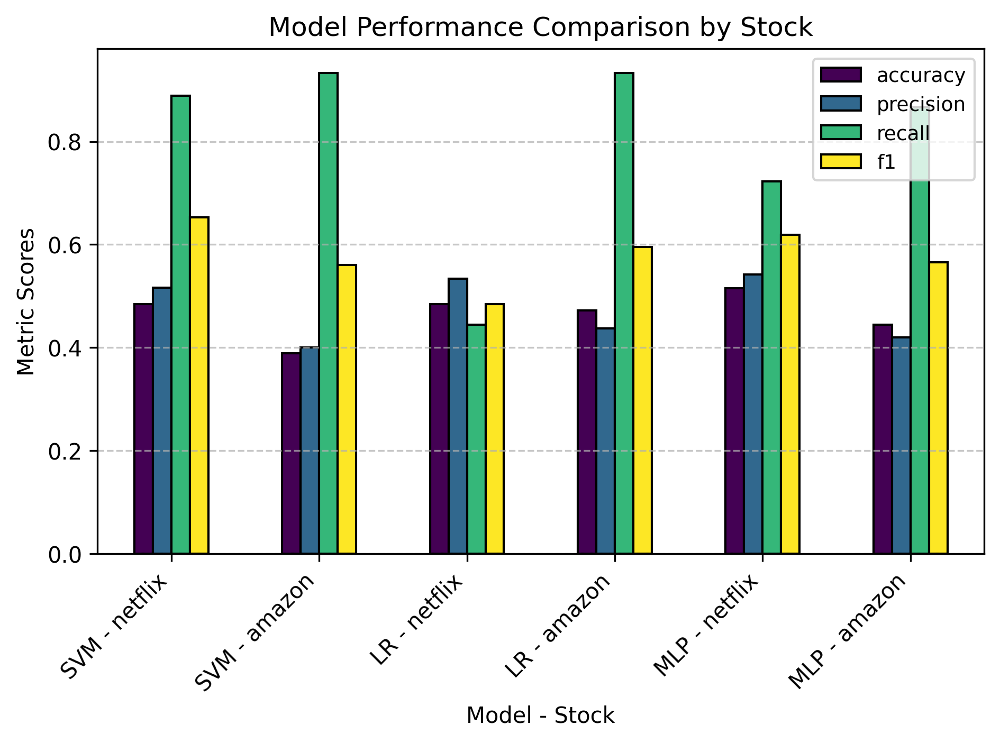
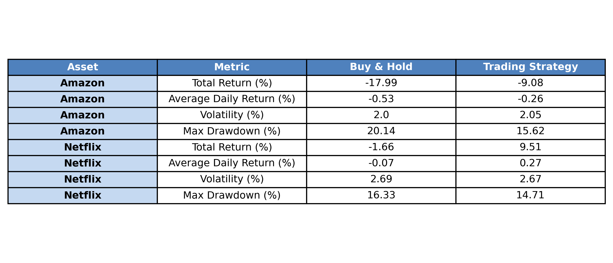

# Tweet Sentiment Trading Strategy

This repository contains Jupyter notebooks for predicting stock price movements of **Netflix** and **Amazon** using supervised machine learning models, based on Twitter/X sentiment data. The project evaluates the performance of **Logistic Regression**, **Multi-Layer Perceptron (MLP)**, and **Support Vector Machine (SVM)** classifiers, and assesses their effectiveness via **backtested trading strategies**.

---

## 🎯 Objectives

- **Tweet Scraping**: Collect historical tweets mentioning Amazon and Netflix using web scraping from specific accounts.
- **Sentiment Analysis**: Analyze and classify tweet sentiment as positive, negative, or neutral.
- **Trading Strategy**: Develop a sentiment-driven trading strategy to generate buy/sell signals.

---

## 🔁 Project Workflow

### 1. Data Collection
- Tweets were scraped using Playwright for both Amazon and Netflix (note that X sometimes changes its DOM structure so might have to amend selector).
- Raw tweet data was cleaned and preprocessed for sentiment analysis.

### 2. Sentiment Analysis & ML Modeling
- Each tweet was analyzed and labeled with sentiment (positive, neutral, or negative).
- Machine learning models (Logistic Regression, SVM, and MLP) were trained to find correlations between sentiment trends and subsequent stock price movements.

### 3. Trading Strategy Development
- A simple trading strategy was implemented using the predicted sentiment as a signal for long or short positions.
- Backtesting was conducted to evaluate performance relative to a buy-and-hold benchmark.

---

## 📊 Data

| File | Description |
|------|-------------|
| `amazon_all_tweets.csv`, `netflix_all_tweets.csv` | Raw, unprocessed tweets scraped from Twitter. |
| `tweet_sentiment_df.csv` | Contains sentiment scores derived from the raw tweets. |
| `merged_sentiment.csv` | Combines sentiment data with market data and includes the target variable `return_sign` for supervised learning. |

---

## 📈 Results

### Sentiment Distribution

The chart below shows the aggregated VADER sentiment values for Netflix and Amazon:

### Model Performance

The graph below shows the performance of the models. Note that recall is very high, while precision is relatively low. This indicates that the models are able to catch most of the positive signals but also generate many false positives. Sentiment alone is a weak predictor of stock price movements, which aligns with findings in academic research, where predictive power tends to be low unless combined with other technical indicators or news.

### Trading Strategy vs. Buy & Hold

The chart below compares the indexed performance of the sentiment-based trading strategy to a buy-and-hold benchmark for Amazon and Netflix respectively.

Below is a summary of the performance metrics comparing the sentiment-based strategy to buy-and-hold for Amazon and Netflix.

### Results Summary
- For both Amazon and Netflix, the sentiment-based trading strategies **outperformed** a basic buy-and-hold strategy during the backtesting period.
- However, **model performance metrics** (accuracy, precision, recall) were **relatively low**, aligning with findings in similar academic research.
- This suggests that while some predictive power exists, results could be driven partly by chance. **Further improvements**, including more features, alternative sentiment models, and larger datasets, are recommended for enhanced strategy robustness.

---

## 🚀 Future Work

- Integrate additional sentiment sources (e.g., Reddit, news headlines).
- Test on more stocks and over longer periods, and integrate trading costs for more realistic results.
- Incorporate technical indicators alongside sentiment features.
- Experiment with ensemble models or LSTM-based approaches.

